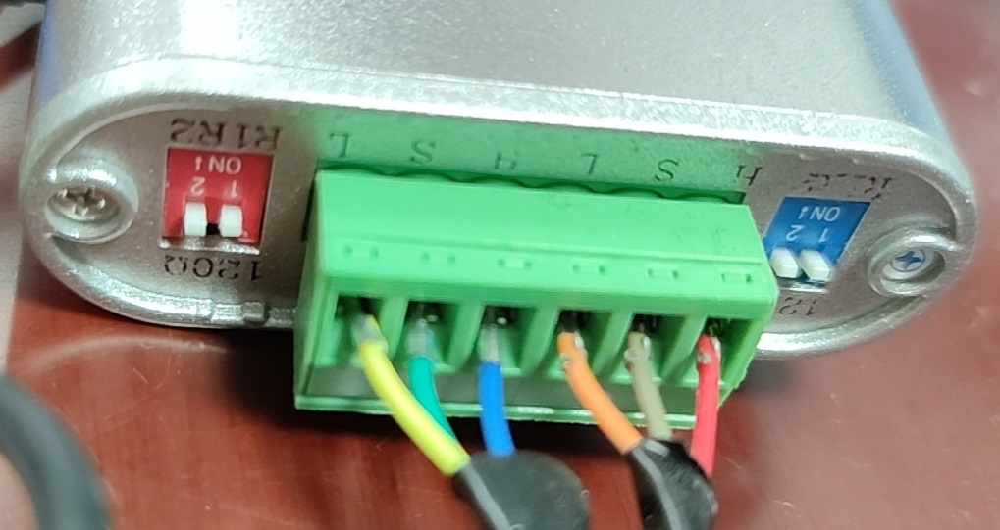
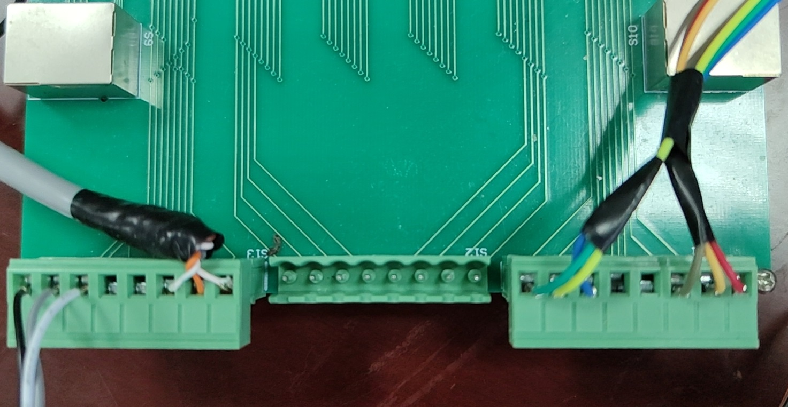
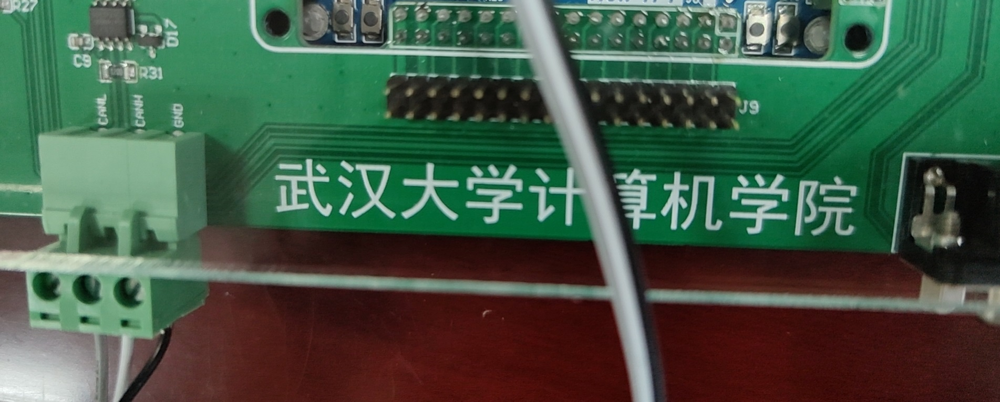

# Overview of the Dev Environment of the Whole System

这里我们对设备端的开发环境做一个综述，方便开发者对全系统有一个较高视野的了解。

系统总线：
* 光纤以太网：信息部分包括视频、数据库、前端FETK
* CAN 网：控制部分（未来考虑工业以太网）

上位机部分：
* CAN 分析仪
* ST-LINK/V2.1
* CAN 网线 ―― 直接控制伺服电机，电磁阀的控制通过控制电路板进行

两个通道都被使用。通道 0 控制伺服电机，通道 1 控制电磁阀及其它。
位置传感数据也通过通道 1 传递。两个通道在 CAN 转接板上对应的接线如下：

注意左边是通道 1 的三根线，接控制板。右边是通道 0 的三根线，接伺服控制器。

控制板的 CAN 接线如下：

控制电路板：
* ST-LINK/V2.1
* CAN 网线
* 电磁阀
* 位置传感器
* 核心板
* 接口板
* 24v 开关电源

红色 24v，黑色为 GND。

红色 24v，黑色接 COM。（注意接口上方的三个 COM 及三个 + 刻印标记，+ 号接口输出 24 v）

系统连接正常后运行测试程序进行系统检测诊断：

