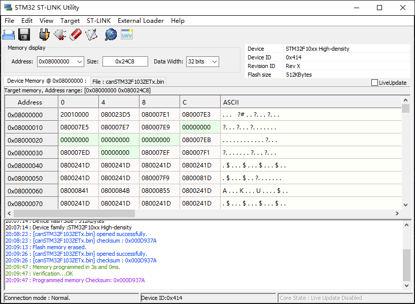

# Debugging and downloading via ST-LINK/V2-1

[^_^]:

[STM32 NUCLEO AND DFU USB BOOTLOADING](https://mobilewill.us/stm32-nucleo-and-dfu-usb-bootloading/)

[STM32F0, ST-link v2, OpenOCD 0.9.0: open failed](https://stackoverflow.com/questions/31638347/stm32f0-st-link-v2-openocd-0-9-0-open-failed)

*****************************

* ST-LINK/V2.1 is a development tool that can simulate and download ST chips online
* Support conversion to Link 0B emulator and USB serial port (slightly limited use)
* By brushing, you can transform into a DAP emulator and support non-ST chips
* Simultaneous support for emulation and USB to serial port, standard 2.54-10P 
interface; SWD, SWIM, serial port

First upgrade the firmware of the simulator, please refer to 
<https://www.st.com/en/development-tools/stsw-link007.html#documentation>.

硬件的连接方法具体过程参见
[使用 ST-LINK/V2-1 将程序下载到电路板](https://gitee.com/industry-ai/embedded-programming-windows/blob/master/readme.md#3-使用-st-linkv2-1-将程序下载到电路板)

连接完成后上电将编译好的 bin 文件下载到板中，方法有很多种。
如果拖拽操作下载不成功，或者粘贴操作不成功，可以从官网下载 STM32 ST-LINK Utility 安装后使用。

具体操作参见<https://www.cnblogs.com/pudonglin/p/14216141.html>

